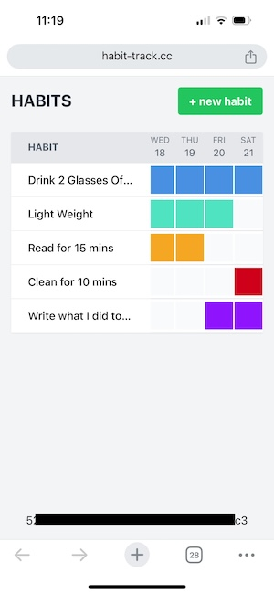

# Habit Tracker

## Introduction

I wanted to start tracking some habits to help me reflect on my days, which often go by too quickly. After searching the app store and trying out several habit tracking apps, I found the results to be mixed. Most apps required in-app purchases, had limited functionalities, or offered clunky interfaces. One app even required a subscription just to add an additional habit, no thanks!

Frustrated, I decided to build my own app to avoid these restrictions. I set clear boundaries and spent a week outlining my requirements, with the goal of completing the project in one day. This is the result of that day project.

I intentionally avoided using a JavaScript framework to keep things simple. The only helper I used was Tailwind CSS, as I wanted to save time on styling while still knowing CSS. The app is built using basic HTML, JavaScript, and Tailwind for styling. It works on both desktop and mobile, requires no login, and provides a clean user experience. While I might add more features in the future, feel free to expand and modify it as you wish.



### Note on Saving and Sharing

To keep things simple, I opted not to implement authentication, which would add unnecessary overhead. Instead, I included a unique save key (the string at the bottom) that is stored in local storage on your browser. This key will remain until you remove or change it. If you change it, you'll get a new habit list. This also allows you have to have many.

I recommend copying this key and emailing it to yourself. This way, if your browser clears local storage for any reason, you can easily restore your habits. You can also use this key on different devices—simply copy it to manage your habits on both your computer and phone.

## Deployment

I deployed the app using Cloudflare because of its ease of use and cost-effectiveness. It utilizes KV storage and Cloudflare Pages/Functions for the actual site.

## Running Locally

To run the app locally, use the following command:

```bash
npx wrangler pages dev . --kv=DB

## Generate Tailwind styles
npx tailwindcss -i ./input.css -o ./styles.css --watch
```
